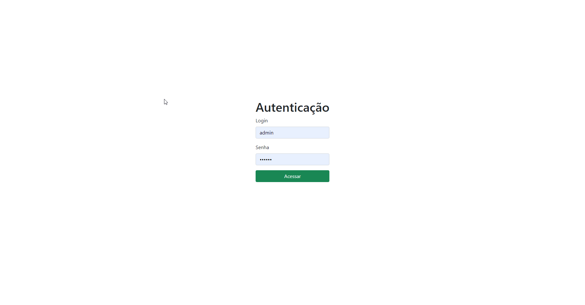

###### Execução do projeto

Na pasta com o código fonte execute `npm install` para gerar a pasta node_modules com as dependências.

Para dar start no projeto, execute `npm start --open`, o endereço padrão é `http://localhost:4200`

Tela inicial da aplicação: 

Realize login com:

admin 123456

comum 123456

